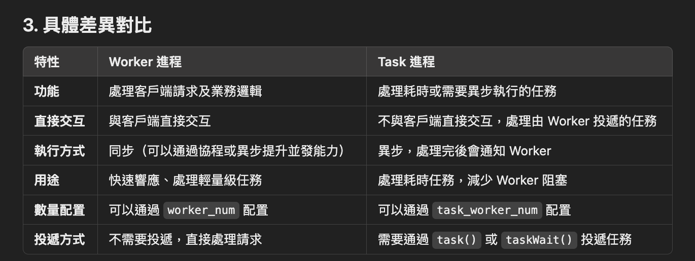
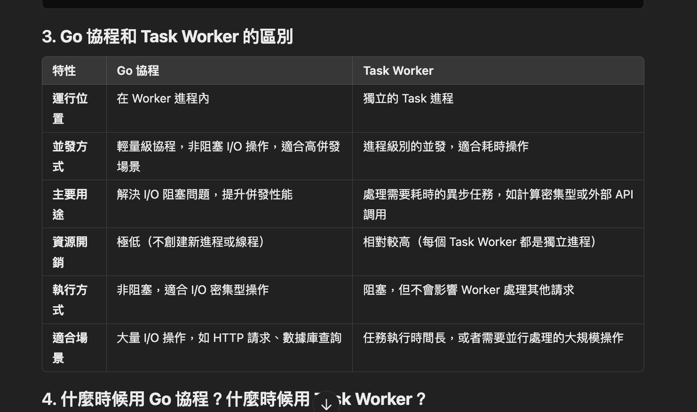
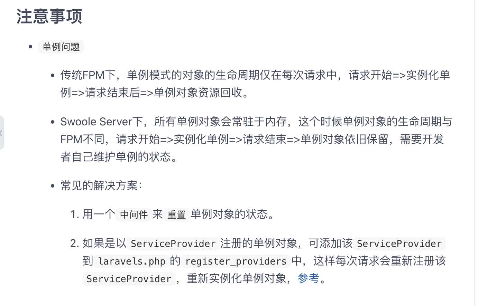

## About swoole-game-server

本篇內容為分享會內容，只為研究框架以及測試其性能目的。
於是以下目前只紀錄log book作為紀錄。

hhxsv5/laravel-s swoole開啟遊戲服務
前端目前先直接用canvas連接websocket

## log book

 - **20241018**

#### install laravel
composer create-project --prefer-dist laravel/laravel laravel-app

#### install laravel-s
composer require hhxsv5/laravel-s

#### new config publish
php artisan laravels publish

#### create websocket Handler Controller 
config/laravels.php should setting route

20241020
從portal進入後會建立laravels class是由hhxsv5/laravel-s的server建立swoole\Server的

20241021
更新laravels設定
以及artisan laravels console setting顯示畫面
指定port and server type決定開啟服務器

20241022
修改storage/laravels.conf 改名為laravels.conf.temp
php artisan config:clear
php artisan config:cache
得以重新序列化

待辦清單：
- 開放多個server laraverls
- 設定多個服務器路由
- docker化可以放最後, swoole設定有點麻煩
- nginx setting
- 開放多個socket服務

紀錄note
- swooleTable 綁定fd與uid, 可選，也可以用全局儲存 Redis\Memcached\Mysql 但注意多個swoole server fd可能衝突
- nginx 

#### Master-worker

swoole會掛起幾個服務

master: 核心 監聽網路接口 接收client data, 根據演算法分配任務到worker
manager: 管理 worker 進程, worker死掉該worker會自己掛起新的worker
task wokrer: 好食任務 由worker丟進來處理
worker：業務邏輯worker

進程間通訊透過unix socket, 
可藉由swoole\Table(多進程共享資料結構 key map)實現進程間共享資源

高請求進來會自動掛起io, 給其他worker處理等待io結束重新掛回worker

## golang diff

#### Golang
Golang 原生支持協程，稱為 goroutine。這些 goroutine 是非常輕量級的，運行在單個進程內部。Golang 的運行時系統內建了一個調度器，會自動將 goroutine 映射到操作系統的線程（kernel thread）上執行。這樣可以實現高效的並發執行，而不需要用戶手動管理線程或進行複雜的同步處理。Golang 的特點在於：

單進程，多協程（goroutine）：Golang 的協程可以在同一個進程中執行，並由運行時的 M
調度器自動管理，將多個 goroutine 映射到多個操作系統線程上。

自動調度：Golang 調度器自動負責協程的分配和切換，開發者不需要手動干預。

輕量級：Goroutine 的棧空間非常小（初始約 2 KB），並且可以動態擴展，因此可以輕鬆創建成千上萬的 goroutine 而不會對系統資源造成壓力。

#### Swoole
Swoole 的協程是 PHP 上額外實現的功能，它的協程是用戶態的“模擬協程”，並不是原生的系統級別線程。Swoole 依賴於 PHP 的進程模型來實現高並發，同時通過 worker 進程 和 協程 的結合來達到類似 Golang 的高並發效果。

多進程模型：Swoole 通常會啟動多個 worker 進程，每個 worker 進程運行在單個操作系統線程上，並且在每個 worker 進程內使用協程來進行非阻塞 I/O 操作。這意味著多個 worker 是基於多進程實現的。

協程調度：Swoole 內部有一個協程調度器，負責在每個 worker 進程內進行協程的切換。當一個協程遇到 I/O 操作時，它會自動掛起並讓出 CPU，等待 I/O 完成後再恢復執行。

worker 進程的使用：Swoole 的 worker 模型通常是預設開啟多個進程來模擬多線程環境，因此每個 worker 處理的是單個進程內的多個協程。而不同 worker 進程之間無法共享內存，這和 Go 的 goroutine 是運行在同一個進程中不同。

- worker and taskworker difference

- go thread and task worker difference

#### socket io

**20241025**
selec/poll/epoll是啥

eventloop reactor 模型 process持續監聽 不阻塞
reactor模型 用於大量io處理

具體來說會在worker內部運行一個thread當作reactor在處理這件事

barrier可以卡住thread等待完成
process\pool 管理進程
Swoole\Thread\Pool 

**20241101**
